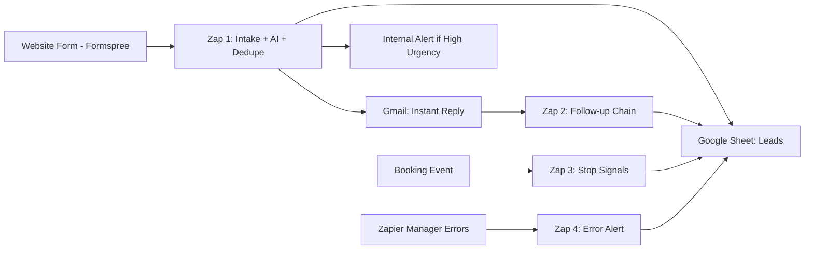

# Lead Intake Automation MVP

Production-style lead automation for local service businesses using:

`Formspree -> Zapier -> Google Sheets -> Gmail`

This project is built for no-code AI automation portfolios and demonstrates speed, reliability, and operational clarity.

## What This System Does

- Captures every lead from a website form
- Stores all leads in Google Sheets as source of truth
- Sends instant auto-response email (target: under 1 minute)
- Classifies each lead with AI triage JSON
- Dedupes repeat submissions within 24 hours
- Triggers follow-up sequence for non-responders (+2h, +24h, +72h)
- Alerts on urgent leads and Zap failures

## Architecture

## Form Payload Contract

Current fields in `/Users/yurian/Codex/pages/index.html`:

- `name` (required)
- `email` (required)
- `phone` (required)
- `city` (required)
- `zip` (required)
- `business` (optional)
- `trade` (required, maps to `service`)
- `message` (optional)
- `source` (hidden, value: `localestimatepages.online`)

## Google Sheets Schema

Create a sheet tab `Leads` with this exact column order:

1. `lead_id`
2. `created_at`
3. `name`
4. `email`
5. `phone`
6. `city`
7. `zip`
8. `service`
9. `message`
10. `source`
11. `status`
12. `ai_intent`
13. `ai_service_type`
14. `ai_urgency`
15. `ai_summary`
16. `ai_next_action`
17. `dedupe_key`
18. `is_duplicate_24h`
19. `first_response_at`
20. `followup_stage`
21. `next_followup_at`
22. `last_contacted_at`
23. `error_flag`
24. `error_message`

Statuses used:

- `new`
- `responded`
- `duplicate_24h`
- `booked`
- `closed_no_reply`
- `error`

## AI Triage Contract

Expected JSON object:

- `intent`: `estimate | urgent | question | spam`
- `service_type`: short string
- `urgency`: `low | medium | high`
- `summary`: max 200 chars
- `next_action`: `call_now | text_now | send_quote | request_more_info | ignore`

Prompt file: `/Users/yurian/Codex/docs/ai-triage-prompt.md`

## Build Docs (Click-by-click)

- Zap setup: `/Users/yurian/Codex/docs/zapier-build.md`
- Email templates: `/Users/yurian/Codex/docs/email-templates.md`
- Test + acceptance checklist: `/Users/yurian/Codex/docs/test-plan.md`
- Demo recording script (2-3 mins): `/Users/yurian/Codex/docs/demo-script.md`
- Sheet starter CSV: `/Users/yurian/Codex/docs/google-sheet-template.csv`

## Portfolio Deliverables Checklist

- [ ] Working Formspree -> Zapier intake
- [ ] AI triage data written to sheet
- [ ] Duplicate suppression tested
- [ ] Follow-up chain tested
- [ ] Error alert tested
- [ ] Demo video recorded
- [ ] Screenshots added under `/Users/yurian/Codex/docs/screenshots/`

## Security and Data Hygiene

- Never commit API keys, tokens, or webhook secrets
- Use sanitized sample lead data only
- Keep real customer PII out of public repo

## Local Website

Static files are in `/Users/yurian/Codex/pages/`.

- Main page: `/Users/yurian/Codex/pages/index.html`
- Styles: `/Users/yurian/Codex/pages/styles.css`
- Config: `/Users/yurian/Codex/pages/vercel.json`
